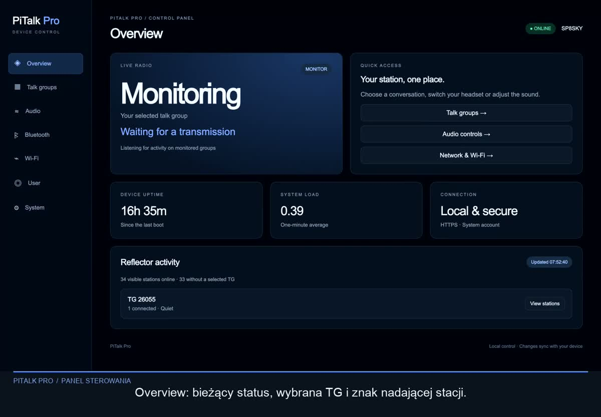

# PiTALK PRO

**A Raspberry Pi radio terminal project with a custom, 3D-printable handheld enclosure.**

[Polski](README.pl.md) · [Printable parts](#printable-parts) · [Hardware](#hardware) · [Assembly](#assembly) · [Watch the demo](Video/PiTalk-Pro-z-lektorem.mp4)

[](Video/PiTalk-Pro-z-lektorem.mp4)

*Control panel preview from the project demonstration. The video includes Polish narration.*

## About the project

PiTALK PRO brings a Raspberry Pi 3 Model B, an Adafruit PiTFT 2.2″ display and a Sabrent USB sound card into a custom enclosure inspired by classic handheld radios. Four physical buttons sit beside the display. The enclosure includes a separate front panel, ventilation, decorative knobs and a removable decorative antenna.

This repository currently contains **printable STL models and a demonstration video**. Application source code, firmware and software installation instructions are not included in this release.

The mechanical design was refined through repeated physical print-and-fit checks. The latest file set combines the **V32 body**, **V38 flat front** and **V11 button caps**. Fit still depends on the exact hardware and printer tolerances.

## Printable parts

Download the repository with **Code → Download ZIP**, or open an individual file below. Dimensions are in **millimetres**.

| Part | STL file | Print quantity |
| --- | --- | ---: |
| Body with ventilation and reinforced nut mounts | [Body V32](stl/01_Body_V32.stl) | 1 |
| Flat front panel with display window and grille | [Front V38](stl/02_Flat_Front_Panel_V38.stl) | 1 |
| Rounded button cap | [Button cap V11](stl/03_Button_Cap_V11_Print_4.stl) | **4** |
| First decorative knob | [Control knob 1](stl/04_Control_Knob_1.stl) | 1 |
| Second decorative knob | [Control knob 2](stl/05_Control_Knob_2.stl) | 1 |
| Decorative antenna base | [Antenna base](stl/06_Antenna_Base.stl) | 1 |
| Decorative 70 mm antenna | [Antenna](stl/07_Decorative_Antenna_70mm.stl) | 1 |

**Seven STL files, ten printed parts.** The button-cap file contains a single cap.

### Current design details

- Flat front surface between the recessed grille rows, replacing the earlier raised curved ribs.
- Forty bottom ventilation slots in eight rows of five; each slot is 6.6 × 2.6 mm with R1 corners.
- Reinforced lower corner mounts joined to the enclosure walls.
- Side-entry pockets for M3 nuts measuring **5 mm across flats × 2 mm thick**. Pocket clearance is **5.5 × 2.6 mm**.
- Lower front fixings use **countersunk M3 × 12 mm screws**.
- V11 button caps are 3.5 mm tall overall, with an R0.6 top edge.

## Hardware

| Component | Design reference / notes |
| --- | --- |
| Raspberry Pi | **3 Model B**; compatibility with other boards has not been established |
| Display | **Adafruit PiTFT 2.2″ 240 × 320 HAT**, with four onboard buttons |
| USB audio | Sabrent adapter used in the prototype; measured housing approximately **34 × 23 × 10 mm** |
| Side push button | PBS-110-style momentary button matching the prototype; check dimensions before ordering |
| Lower front fasteners | **2 × countersunk M3 × 12 mm** and **2 × M3 nuts**, measured 5 mm across flats and 2 mm thick |
| Display/front fasteners | Four matching countersunk M3 screws; select length for the actual display spacer stack |
| Power | External power supply appropriate for the Raspberry Pi; no internal battery compartment |

Measure replacement components before printing. A shared product name does not guarantee the same casing or shaft dimensions. Keep the existing display spacers and check the front screw length against the assembled stack.

The supplied knobs and antenna are **decorative**. EC11 encoder integration was discussed as a possible future modification; it is **not implemented in these STL files**. External-radio PTT electronics are also outside this mechanical release.

## Printing

The project was developed using a **Creality K1**. PLA and Creality CR-PETG were used during development; this repository does not include a validated slicer profile or G-code.

- Inspect every model in your slicer and choose settings for your printer and material.
- Print the body with its exterior bottom on the build plate.
- The V38 front STL is positioned with its flat front toward the build plate. Check the first-layer preview and bed texture before printing.
- Review supports for overhangs, particularly the nut-pocket roofs, button-cap flanges and decorative parts.
- Print one button cap first and check movement in the front panel before printing the remaining three.
- A lower layer height can improve finish, but cannot compensate for poor orientation, support contact or inaccurate fit.

## Assembly

1. Remove support material and clean the openings. Check all fits without glue first.
2. Slide the two lower M3 nuts into their pockets **before installing the electronics**. The pockets prevent rotation; a small amount of adhesive may retain the nuts, but keep it out of the threads.
3. Fit the side button, then the Raspberry Pi and display using the matching spacers. Confirm that the connectors line up and that no metal parts short against the boards.
4. Install the Sabrent adapter and route the wiring clear of the front panel, vents and fasteners.
5. Insert the four button caps from the inside of the front. Check that they move freely and do not hold the display buttons down.
6. Place the front on the body. Fit the display/front screws and the two lower **M3 × 12 mm** screws. Tighten gently; do not force the panel or bottom out a screw.
7. Dry-fit and then attach the decorative knobs and antenna assembly. Keep adhesive away from electronics and moving buttons.
8. Check connector access, button travel and ventilation before powering up.

## Repository layout

```text
stl/                  Printable enclosure and accessory parts
Video/                Project demonstration with Polish narration
docs/images/          README preview image
README.md             English project page
README.pl.md          Polish project page
```

## Feedback

For fit problems, include the part/version, printer, material, layer height and a photo or measured discrepancy in a [GitHub issue](https://github.com/sasiela/pitalk-pro/issues).
