# Montaż PiTalk Pro — krok po kroku

Ta instrukcja pokazuje wcześniejszy prototyp. Dla najnowszej pary V39/V42 uwzględnij [zmiany montażowe EC11](MECHANICAL-EC11.md).

[English](ASSEMBLY.en.md) · [Lista części](HARDWARE.md) · [Indeks wszystkich zdjęć](../../photos/README.md)

Kolejność podana przez autora prototypu i zestawiona ze zdjęciami `IMG_3595`–`IMG_3619`. **Zaczynamy od kompletnego frontu**, potem montujemy tylną część obudowy. Zdjęcia pokazują kolejne stany, nie każdą czynność osobno; kroki bez zdjęcia wynikają z instrukcji autora.

Montaż i lutowanie wykonuj przy odłączonym zasilaniu. Przygotuj 4 śruby M3×12 do LCD oraz 2 dolne śruby M3×12, 4 dystanse, 2 nakrętki M3, dwa przewody po około 10 cm, koszulki termokurczliwe i klej na gorąco. Długość dystansów pozostaje do uzupełnienia pomiarem.

## Front

### 1. Umieść przyciski w slotach

Połóż front wewnętrzną stroną do góry i włóż cztery drukowane nakładki w ich sloty. Sprawdź, czy każda porusza się swobodnie.

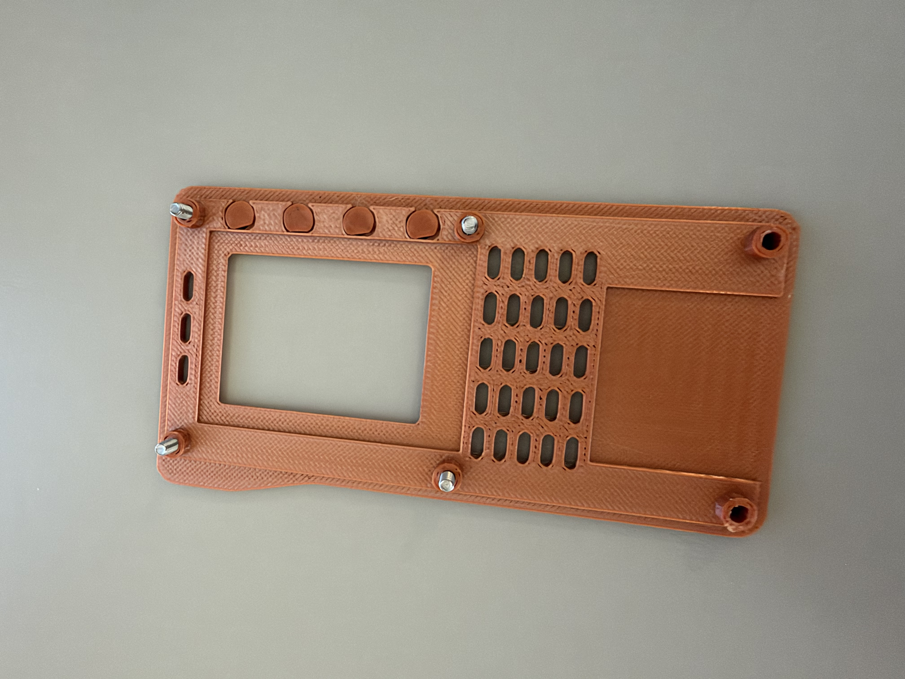

### 2. Umieść cztery śruby M3×12 w panelu

Przełóż cztery śruby od zewnętrznej strony frontu, tak aby gwinty wystawały po stronie montażowej LCD.

### 3. Przyłóż ekran LCD

Nałóż płytkę PiTFT na cztery śruby, ekranem w stronę okna frontu. Przyciski płytki muszą pokrywać się z nakładkami.

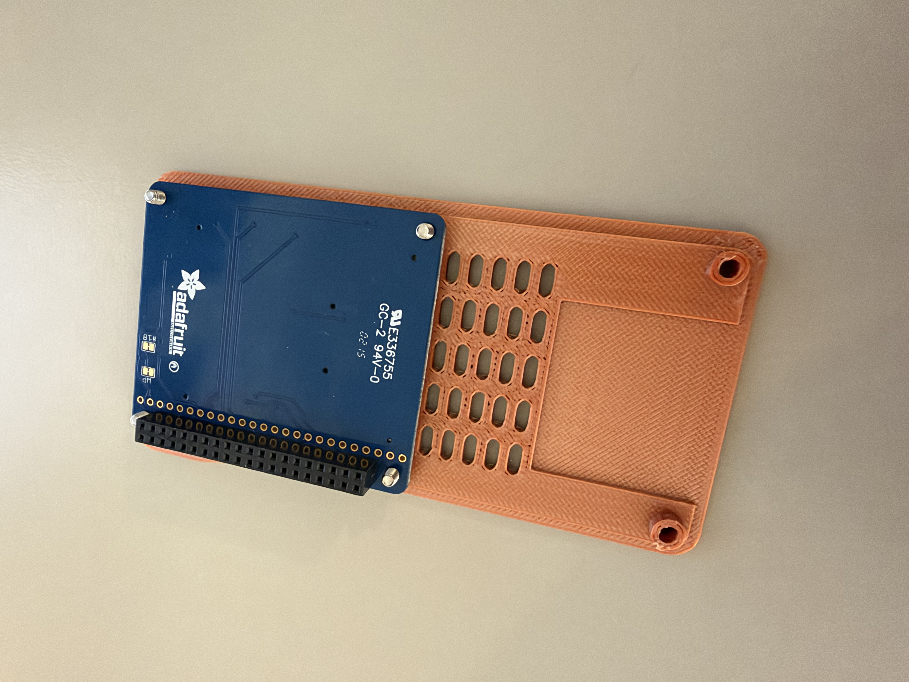

### 4. Przykręć śruby

Ustaw LCD równo w oknie i lekko dociągnij cztery śruby. Nie ściskaj płytki ani nie blokuj nakładek przycisków.

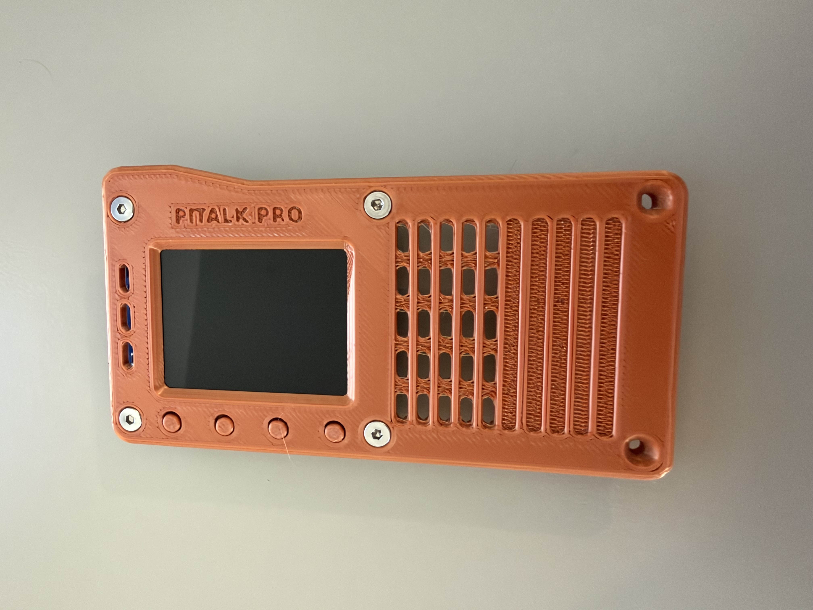

### 5. Przykręć dystanse

Od strony tylnej płytki przykręć cztery dystanse do wystających gwintów. Gotowy front z ekranem odłóż na bok.

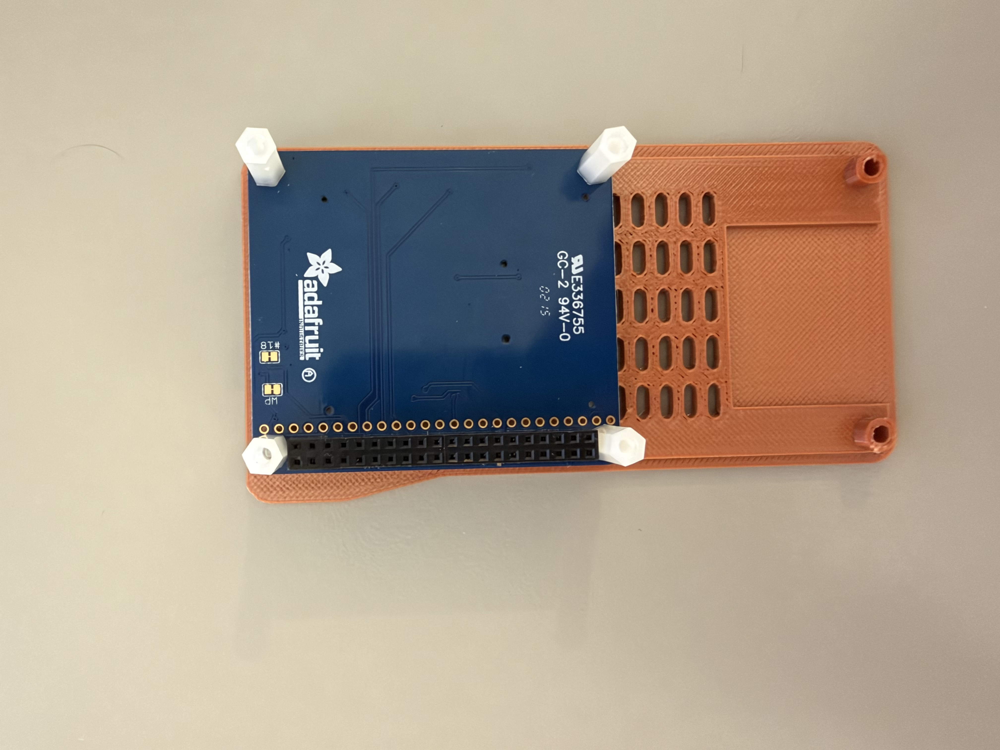

## Tylna część obudowy

Boczny element opisany poniżej to chwilowy przycisk PTT.

### 1. Przylutuj przewody do PTT

Przygotuj dwa przewody, każdy długości około 10 cm. Przylutuj po jednym do każdego styku przycisku PTT. Każde połączenie osłoń osobną koszulką termokurczliwą.

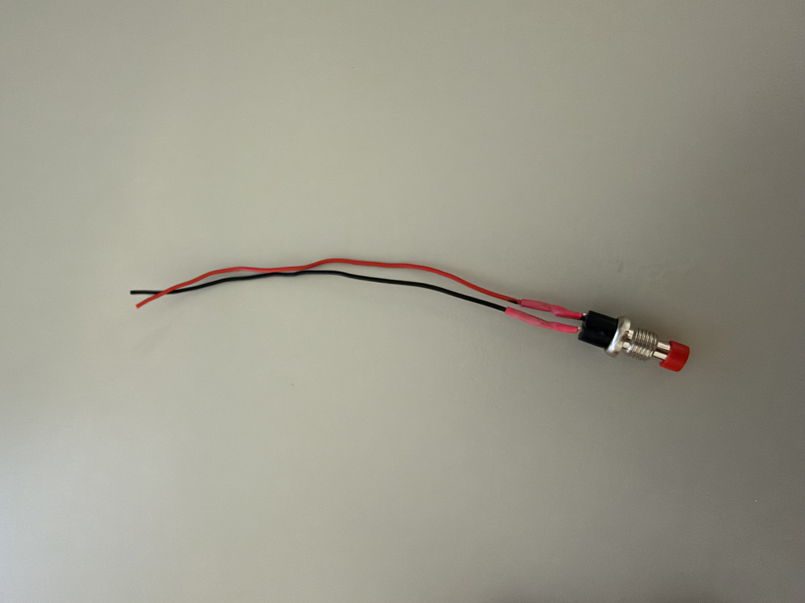

### 2. Zamontuj PTT w obudowie

Umieść przycisk w bocznym gnieździe tylnej części obudowy. Poprowadź przewody do wnętrza, zgodnie z widocznym ułożeniem.

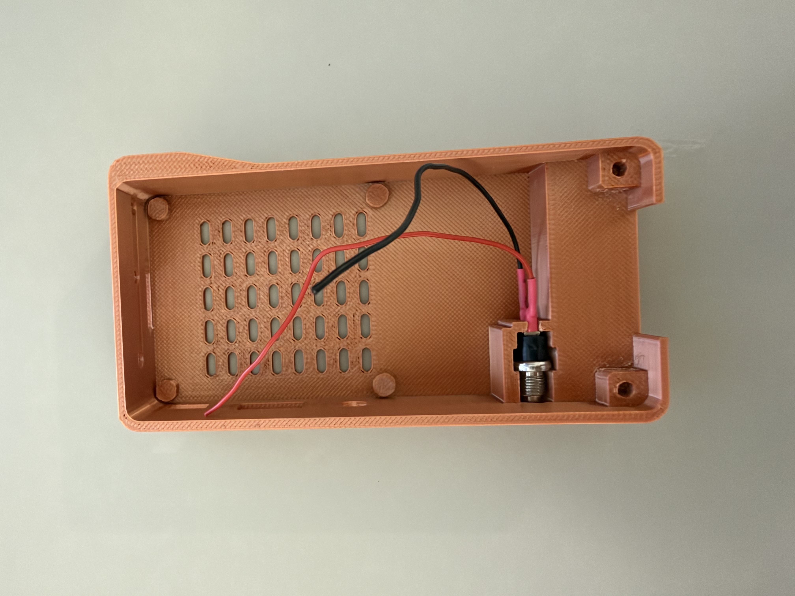

### 3. Zabezpiecz przycisk gorącym klejem

Unieruchom korpus przycisku klejem na gorąco. Nie zalej ruchomego trzpienia; po ostygnięciu sprawdź, czy przycisk wraca po puszczeniu.

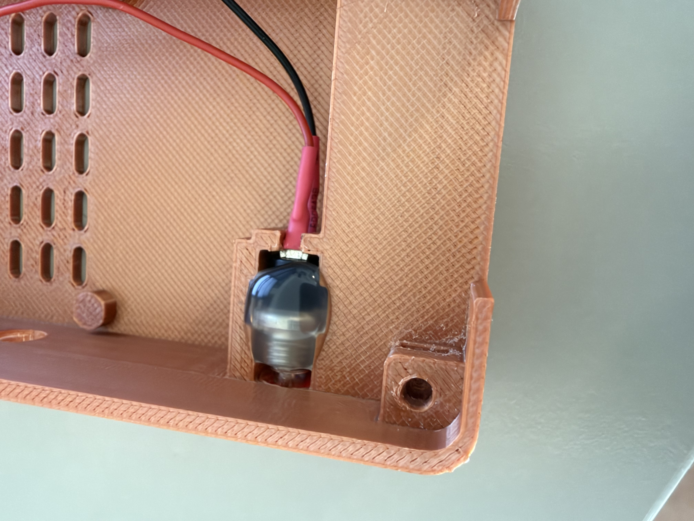

### 4. Wygnij piny 37 i 39 do środka

Przy odłączonym zasilaniu zidentyfikuj fizyczne piny 37 i 39 złącza Raspberry Pi. Delikatnie odegnij je w stronę środka płytki, jak w prototypie, pozostawiając miejsce na złącze PiTFT. Nie odginaj sąsiednich pinów.

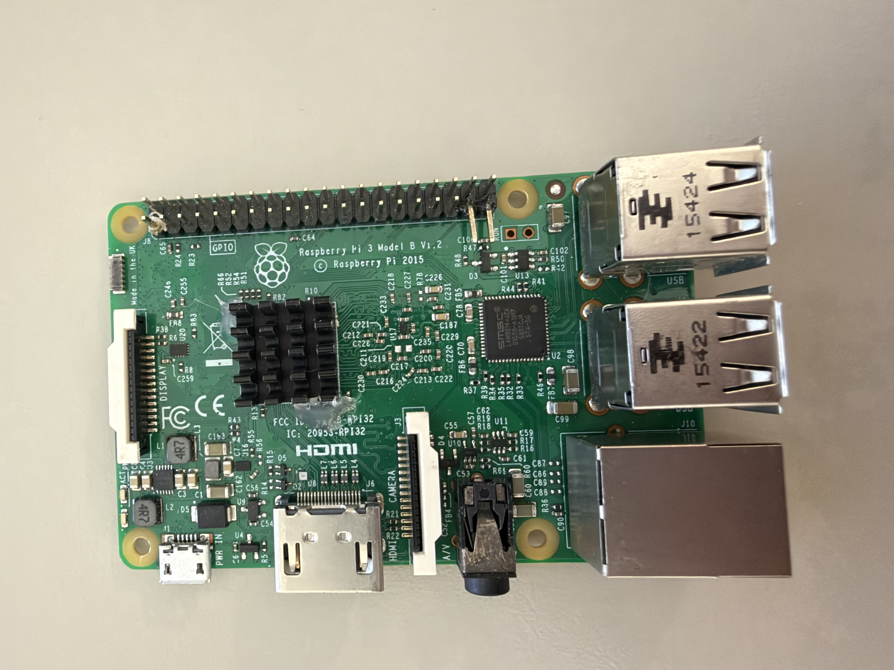

### 5. Przylutuj PTT do Raspberry Pi i zaizoluj

Przylutuj jeden przewód przycisku do fizycznego pinu 37 (GPIO26), drugi do pinu 39 (GND). Na zdjęciu czerwony przewód prowadzi do 37, czarny do 39. Osłoń oba luty osobnymi koszulkami termokurczliwymi; sprawdź brak zwarć z sąsiednimi pinami.

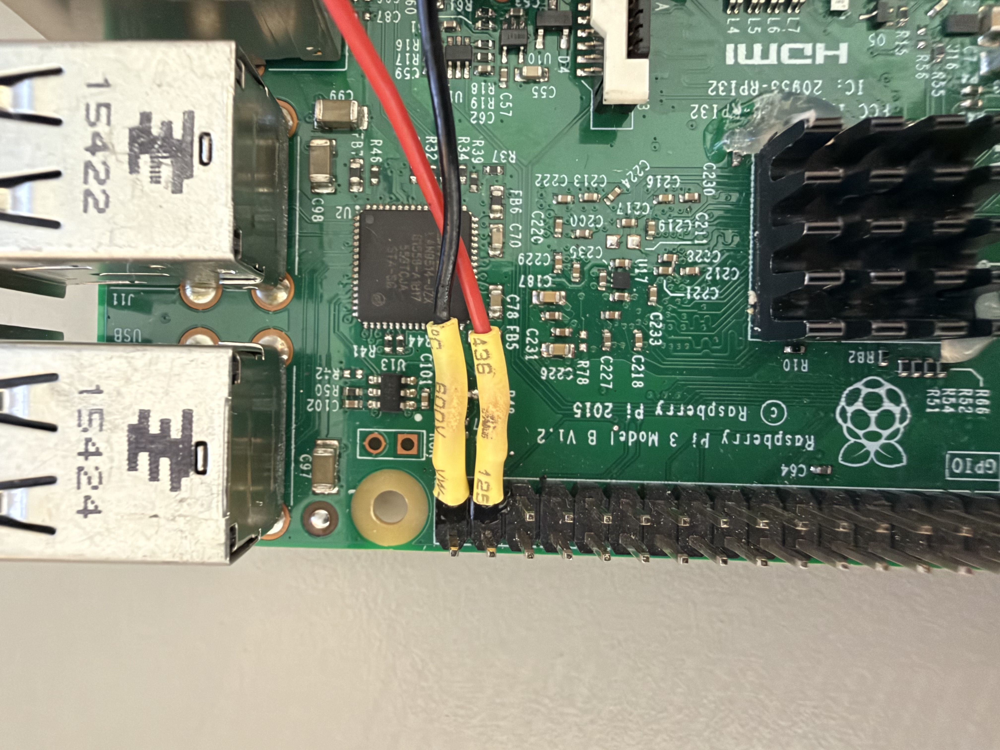

### 6. Włóż opcjonalne akcesoria do dolnych portów USB

Przed umieszczeniem Pi w obudowie włóż potrzebne małe akcesoria do dolnych gniazd stosu USB, czyli gniazd bliższych płytce: np. dongle Bluetooth, odbiornik myszy/klawiatury lub pamięć USB. To krok opcjonalny; zachowaj miejsce na kartę dźwiękową.

### 7. Włóż Raspberry Pi

Umieść płytkę w tylnej części obudowy i dopasuj porty do otworów. Ułóż przewody PTT tak, aby nie były przyciśnięte pod płytką ani nie przeszkadzały w zamknięciu frontu.

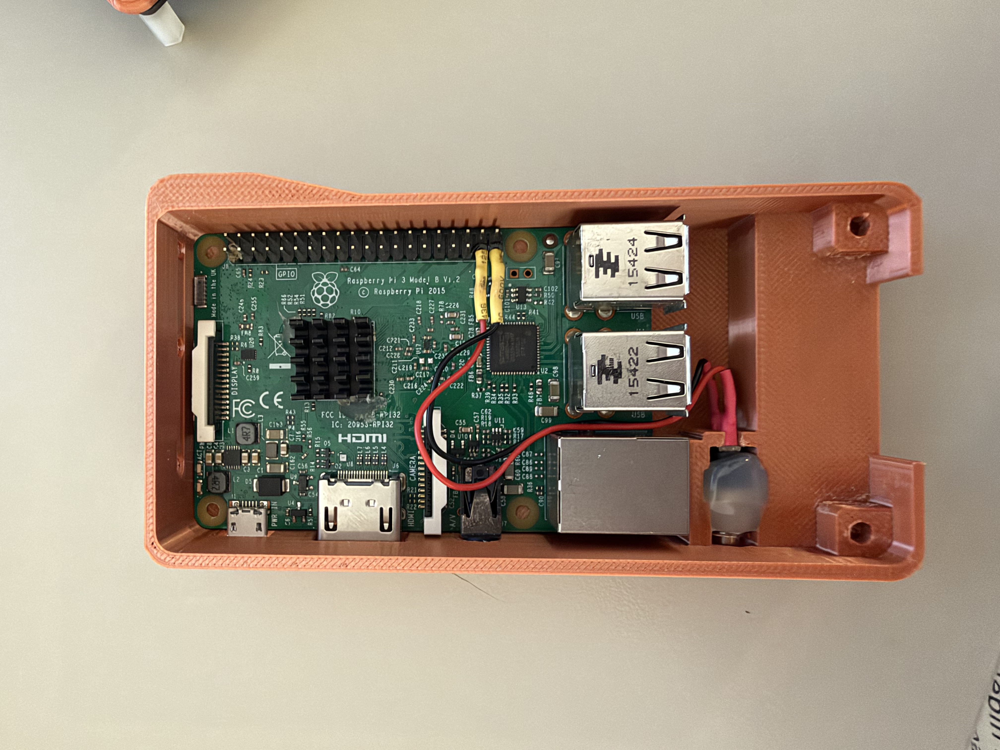

### 8. Włóż nakrętki

Wsuń dwie nakrętki M3 w dolne kieszenie mocujące. Ustaw ich otwory w osi śrub, które na końcu zamkną obudowę.

### 9. Włóż kartę microSD

Włóż przygotowaną kartę microSD do Raspberry Pi przez dostępny otwór. Etap przygotowania systemu opisuje osobna instrukcja instalacji.

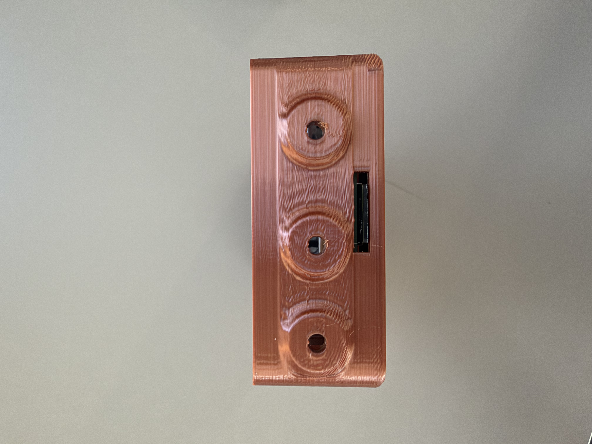

### 10. Zainstaluj kartę dźwiękową

Włóż kartę dźwiękową USB do przeznaczonego dla niej wolnego portu. Sprawdź, czy jej obudowa i złącza mieszczą się bez nacisku.

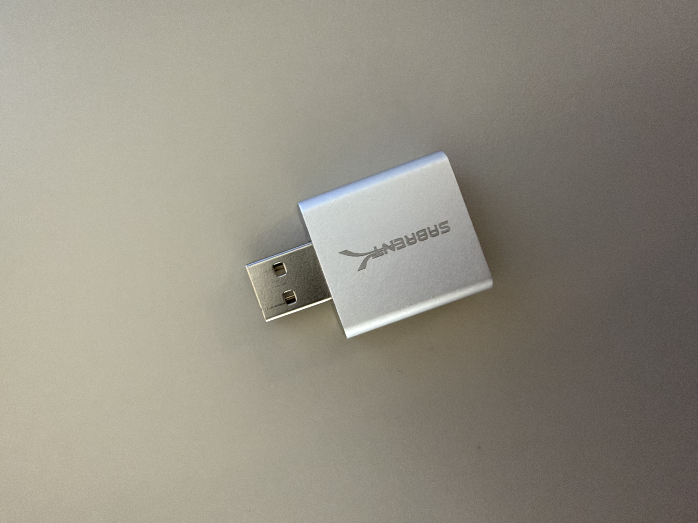

### 11. Zainstaluj front

Przyłóż gotowy zespół frontu z LCD. Wyrównaj złącze PiTFT względem pinów Raspberry Pi, sprawdź przewody PTT i osadź front bez przesunięcia złącza o rząd lub pin.

### 12. Dokręć dolne śruby

Zamknij obudowę dwiema dolnymi śrubami M3×12 w przygotowanych nakrętkach. Dokręcaj stopniowo, bez odkształcania wydruku. Sprawdź ruch wszystkich przycisków i dostęp do portów.

## Numeracja i kontrola PTT

**37 i 39 to fizyczne numery pinów**, a nie numery BCM. Pin 37 odpowiada GPIO26, pin 39 to GND. Numerację można sprawdzić w [schemacie Raspberry Pi 3 B Rev 1.2](https://www.raspberrypi.org/documentation/hardware/raspberrypi/schematics/rpi_SCH_3b_1p2_reduced.pdf). Piny te są na końcu złącza od strony portów USB, w rzędzie bliższym środkowi płytki; przed lutowaniem porównaj orientację ze schematem.

Przy odłączonym zasilaniu sprawdź miernikiem: puszczony PTT nie zwiera przewodów, wciśnięty zwiera je ze sobą. Nie używaj koloru przewodu jako jedynej podstawy identyfikacji pinu. Po montażu przejdź do [instalacji](SOFTWARE.md) i [testu urządzenia](../testing/ACCEPTANCE.md).

## Zakres zdjęć

Seria pokazuje front, dystanse, przygotowanie PTT, jego osadzenie i klejenie, lutowanie do Pi oraz umieszczenie płytki w obudowie. IMG_3618 pokazuje dostęp do gniazda microSD, a IMG_3619 samą kartę dźwiękową. Brakuje osobnych ujęć wkładania akcesoriów USB, nakrętek, instalowania karty audio oraz końcowego zamknięcia obudowy. Nie przypisujemy tym zdjęciom czynności, których nie pokazują.
